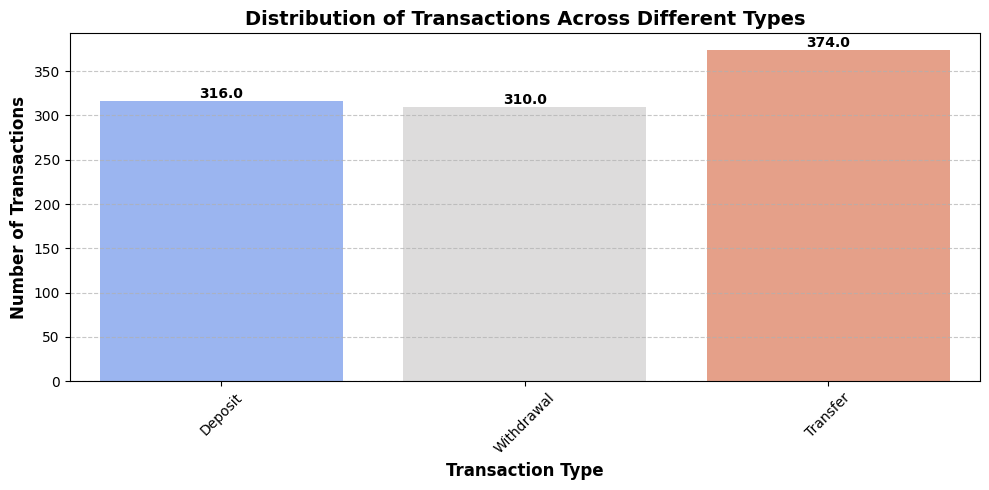
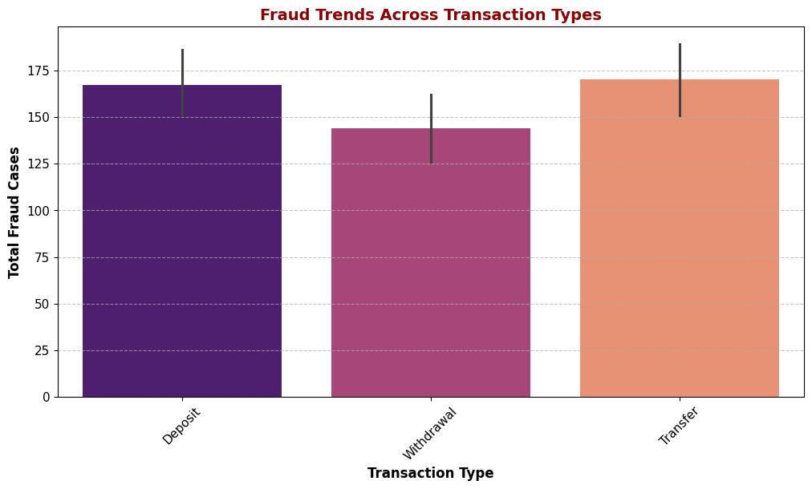
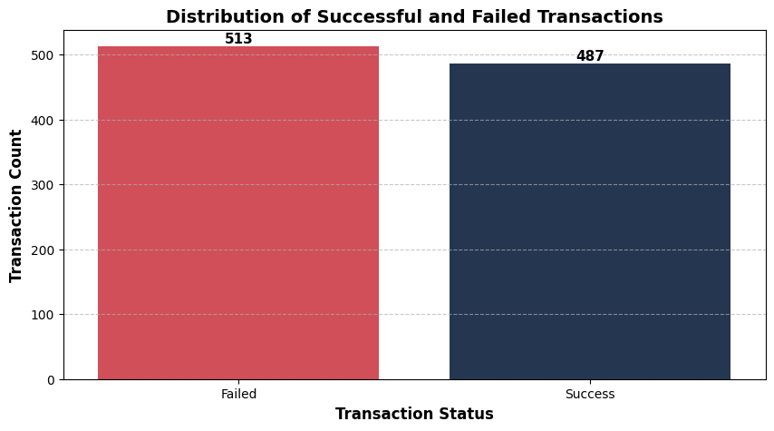
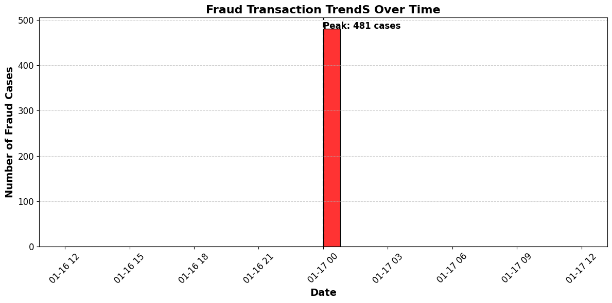
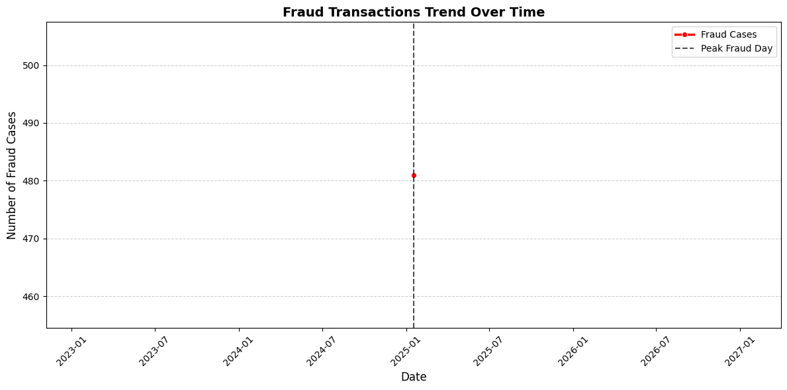
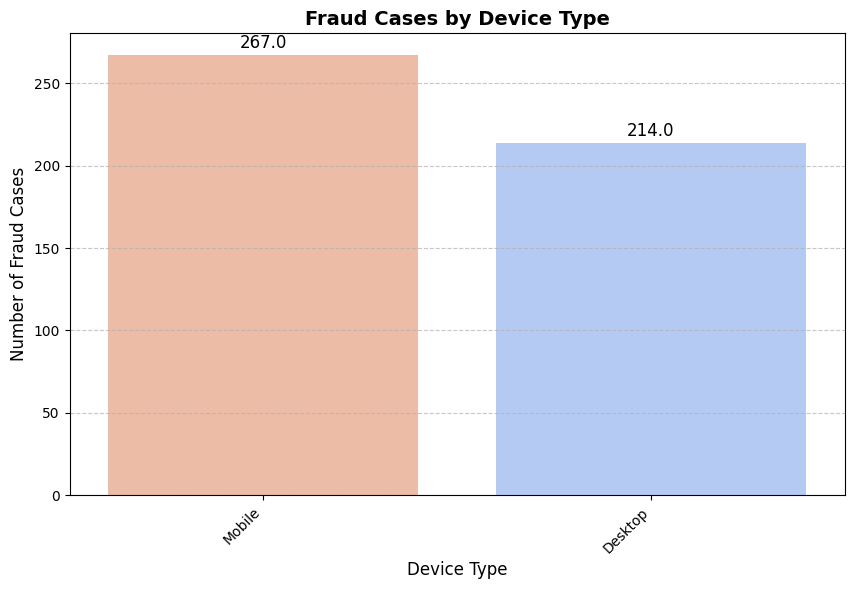
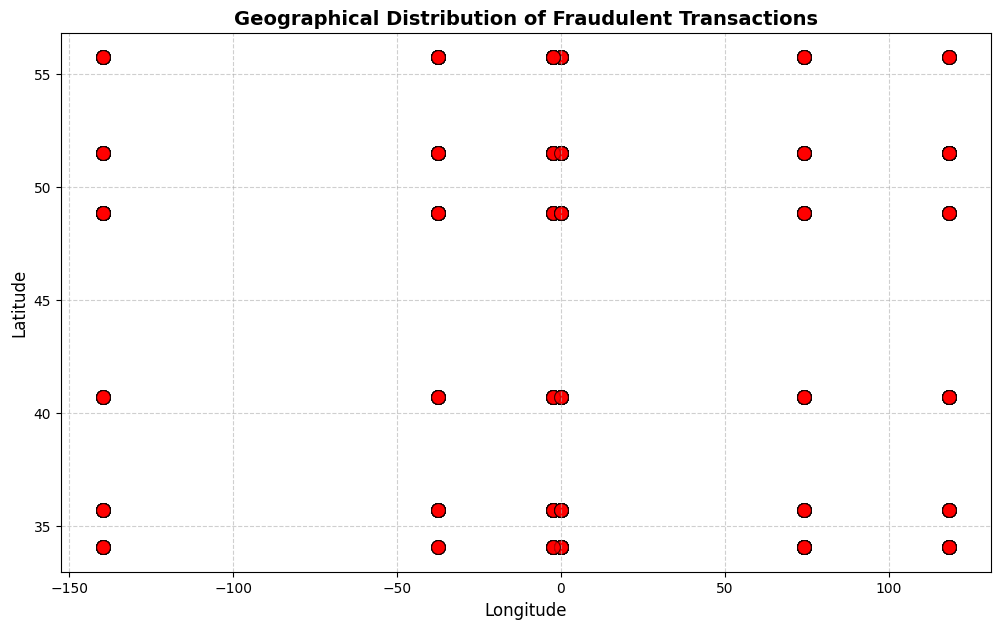
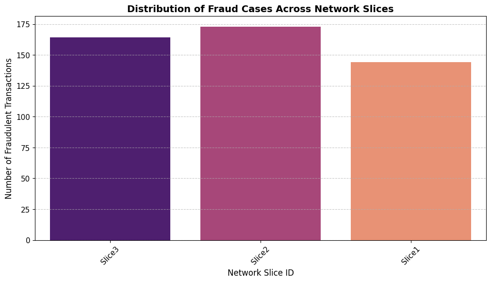
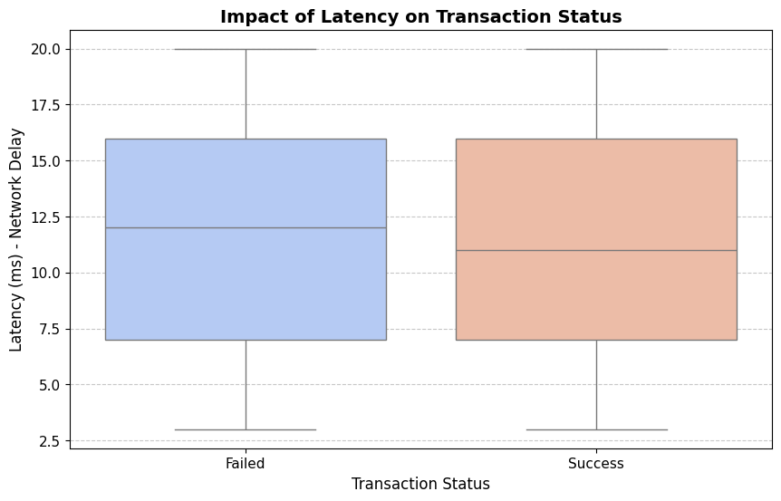
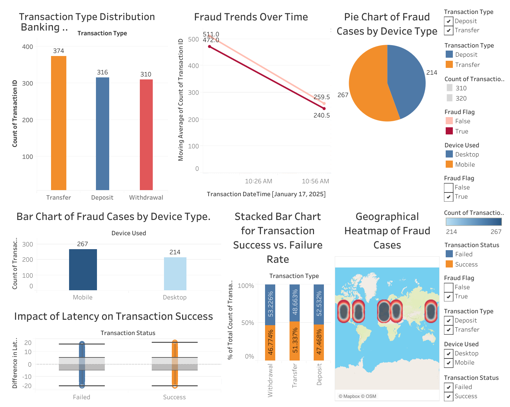

# Phase-1-Project-Banking-Transaction-Analysis


# Banking Transaction Analysis

**Authors**: [Edwin Korir](https://github.com/Edwinkorir38)

## Overview

This project focuses on analyzing banking transactions to identify fraud patterns, transaction success rates, and other key financial insights. The study employs data cleaning, imputation, analysis, and visualization techniques to generate meaningful insights for business stakeholders.

## Business Understanding

### Stakeholder

The primary stakeholders for this analysis are financial institutions, banking security teams, and fraud detection specialists. The insights derived from this analysis can help in mitigating fraudulent activities and improving transaction efficiency.

### Key Business Questions and Objectives

* Understand transaction trends and types.

* Identify fraudulent transactions and common fraud characteristics.

* Determine factors contributing to failed transactions.

* Analyze the impact of device type and network conditions on fraud and failures.

* Examine the geographical distribution of fraudulent transactions.

* Provide data-driven recommendations for improving banking security and efficiency.

## Data Understanding and Analysis

### Source of Data

The dataset was sourced from **[kaggle](https://www.kaggle.com/datasets/ziya07/transaction-data-for-banking-operations)**.The dataset consists of banking transaction records, which include attributes such as transaction amount, type, status, timestamp, fraud flag, device used, and geographical information.

### Description of Data

* Transaction Amount: The monetary value of the transaction.

* Transaction Type: Type of transaction (e.g., withdrawal, deposit, online payment, etc.).

* Transaction Status: Indicates whether the transaction was successful or failed.

* Fraud Flag: A binary indicator (True/False) of whether a transaction was fraudulent.

* Timestamp: The date and time of the transaction.

* Device Used: The device type used for the transaction.

* Latitude & Longitude: Geographical location of the transaction.

## Key Visualizations

**1. Distribution of Transactions Across Different Types**

A bar chart showing the distribution of different transaction types.



**2. Fraud Trends Across Transaction Types**

A bar chart displaying fraud occurrences across various transaction types.



**3. Transaction Success vs. Failure**

A count plot comparing the number of successful versus failed transactions.



**4. Fraud Transaction Trends  Over Time**

A histogram visualizing the frequency of fraudulent transactions over time.
 


**5. Fraud Transactions Trend Over Time(line plot)**

A line plot visualizing the frequency of fraudulent transactions over time.



**6. Fraud Cases by Device Type**

A count plot highlighting which device types are most commonly associated with fraudulent transactions.



**7. Geographical Distribution of Fraudulent Transactions**

A scatter plot mapping the locations of fraudulent transactions based on latitude and longitude.



**8. Fraud Cases Across Network Slices**

a count plot displaying fraud cases across network slices



**9.Impact of Latency On Transaction Status**

Using a box plot to display impact of Latency on transaction status




##  Banking Transaction Analysis: Trends, Fraud & Performance Dashboard  

This dashboard provides an overview of transaction trends, fraud detection patterns, and performance insights.  

  

**[View the Interactive Dashboard](https://public.tableau.com/views/BankingTransactionAnalysisTrendsFraudPerformanceDashboard/Dashboard1)**

### **What This Dashboard Shows:**  

* **Transaction Type Distribution** – Deposits, Withdrawals, Transfers  

* **Fraud Trends Over Time** – Patterns in fraudulent transactions  

* **Success vs. Failure Rate** – Transaction performance insights  

* **Fraud Cases by Device Type** – Mobile vs. Desktop trends  

* **Geographical Heatmap of Fraud** – Fraud hotspots worldwide  

Use the interactive filters in Tableau to explore deeper insights!


## Conclusion

###  Summary of Findings

* Certain transaction types are more susceptible to fraud – Online transactions and high-value withdrawals show higher fraud occurrences.

* Mobile transactions have a higher fraud rate – More fraud cases are linked to mobile-based transactions compared to other platforms.

* Transaction failures occur due to various factors – Network latency, incorrect PIN entries, and insufficient funds contribute significantly to transaction failures.

* Fraud is concentrated in specific geographical locations – Certain regions exhibit a higher number of fraudulent transactions, indicating potential hotspots for financial crime.

* High-value transactions require stricter monitoring – Fraud is more common in transactions with large amounts, suggesting a need for additional verification layers for high-value transactions.

##  Recommendations

* Implement stricter security checks for high-risk transaction types.

* Enhance fraud detection for mobile transactions.

* Improve transaction success rates by addressing failure causes.

* Monitor and flag transactions from high-risk geolocations.

* Develop predictive models for fraud prevention based on identified risk factors.

This analysis provides actionable insights to improve banking security and transaction efficiency. Future enhancements could include machine learning-based fraud detection models for proactive fraud prevention.

##  Next Steps
Further analyses could provide additional insights to strengthen banking security and improve transaction efficiency:

* Fraud Loss Estimation: Understanding the financial impact of fraudulent transactions on the bank and customers. Analyzing the average loss per fraud case could help justify investments in fraud prevention measures.

* Detailed Failure Analysis: Examining failure reasons in-depth, such as transaction declines due to incorrect PIN entries, insufficient funds, or technical issues. Identifying the most common failure causes would help optimize banking operations.

* Competitor Fraud Prevention Strategies: Analyzing how other financial institutions combat fraud could provide benchmarking opportunities. Studying competitors’ fraud detection techniques and security measures would help enhance fraud prevention strategies.

* Impact of Regulatory Compliance: Investigating how compliance with banking regulations affects fraud detection and prevention. Understanding how adherence to regulatory policies reduces fraud risks would support better security measures.

* Real-time Fraud Detection & Prevention: Implementing machine learning models to detect fraud in real time, allowing proactive prevention. Utilizing AI-driven risk assessment models could enhance transaction security.

## For More Information

Please review my full analysis in [my Jupyter Notebook](Banking_Transaction.ipynb) or my [presentation](Presentation.pdf).

For any additional questions, please contact **[Edwin Korir](linkedin.com/in/edduh-kip-01170b288)**

## Repository Structure

```
├── Data                          <- sourced externally and generated from code 
├── images                        <- sourced externally and generated from code
├── .gitignore                    <- gitignore 
├── Banking_Transaction.ipynb     <- Narrative documentation of analysis in Jupyter notebook
├── Presentation_pdf              <- PDF version of project presentation    
└── README.md                     <- The top-level README for reviewers of this project
 